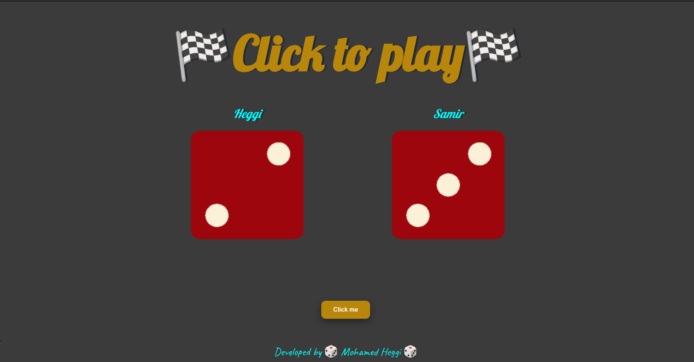
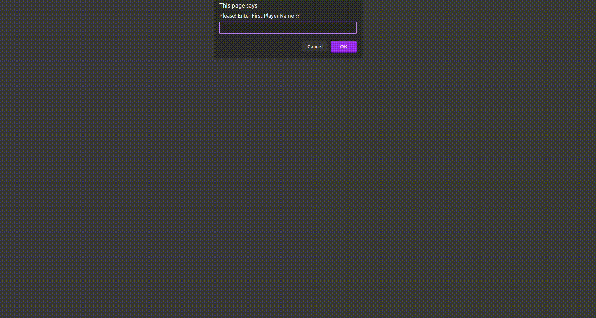

# 🎲 The Dice Game 🎲
Using HTML, CSS, and JavaScript, a straightforward dice game was created. The dice will be randomly thrown after the user selects the Roll the Dice button, giving player 1 and player 2 their respective die values. The player with the most numbers on the dice wins the dice game, with the winner determined by whose dice value was higher. When there are equal numbers, the game is drawn.

## Deployment

Deployed Website: [not deployed yet-- Deploy when repo go public]

## Demo Video 
 </img>

## Built With

  * HTML
  * CSS
  * JavaScript

## Acknowledgments
  * The Complete 2021 Web Development Bootcamp by Angela Yu